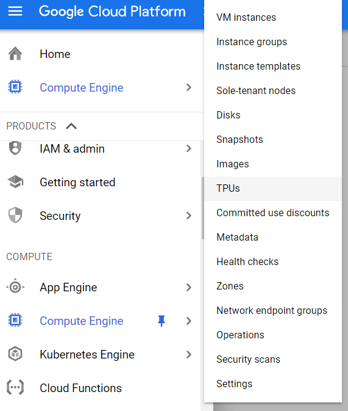

= Guide to set up and use cloud Blast on Google Cloud Platform (GCP). 
:site-section: UserGuide
:toc:
:toc-title:
:toc-placement: preamble
:sectnums:
:imagesDir: images
:stylesDir: stylesheets
:xrefstyle: full
:experimental:
ifdef::env-github[]
:tip-caption: :bulb:
:note-caption: :information_source:
endif::[]

By: `Ho Wei Chin, Tan Wei Qi, Soh Zi Quan, Jessica Low` School: `National Univeristy of Singapore`

== Preface

Go the following URL: `https://github.com/ncbi/blast_plus_docs#google-cloud-platform-setup` .

`Step 1`: Under the table of contents, select “Google Cloud Platform Setup” as shown:

image::img0.PNG[width="790"]

`Step 2`: Scroll down to “Set up your GCP account and create a VM for analysis” as shown:

image::img1.PNG[width="790"]

`Step 3`: Follow the instructions in that section to set up your trial GCP account.

== Introduction

This documentation serves as an user guide to set up and install Blast on the Google Cloud Platform (GCP).

Note: This guide assumes the user has set up their GCP account. Otherwise, the user should look at section Preface to set up his or her GCP account.

`Step 4`: Create a GCP Virtual Machine (VM) running Ubuntu 18.04LTS

On the GCP welcome screen panel, click on "Computer Engine", followed by clicking on "VM instances".

1. Click on the blue "CREATE" buton on the top bar.
2. Fill up the sections with the parameters as shown in the image below, and an estimated cost will be displayed at the right side.
(Note that creating a VM in the same region as storage can provide a better performance.)
3. Finally, click on the blue "CREATE" button at the bottom, which will create and start the VM.

image::img3.PNG[width="790", height="800"]

If you are met with any problems, detailed instructions for creating a GCP account and lauching VM can be found at this link here: `https://cloud.google.com/compute/docs/quickstart-linux`.

`Step 5`: Accessing a GCP VM from a local machine

Upon successful creation of the GCP VM, we must access it from out local computer via SSH. This is done byt clicking on the "SSH" button under the "Connect" column.

image::img4.PNG[width="790"]

